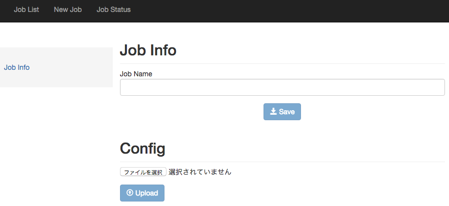
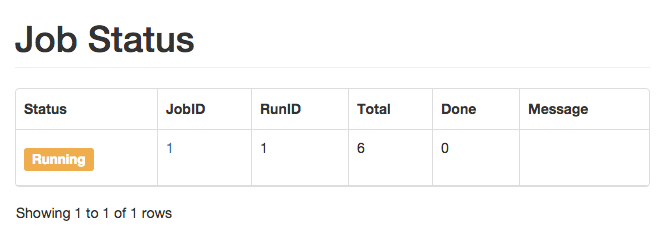
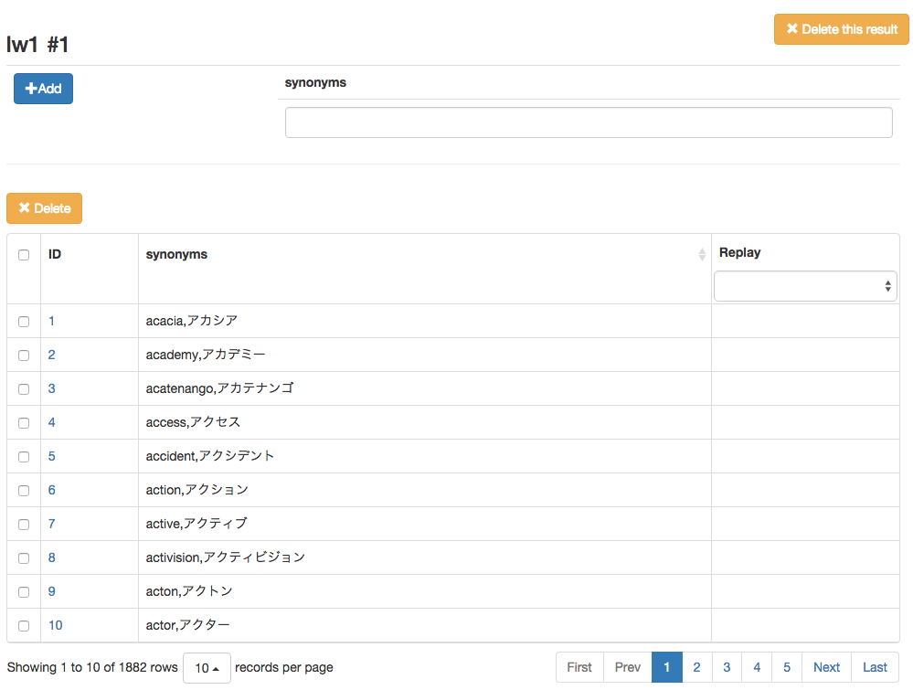
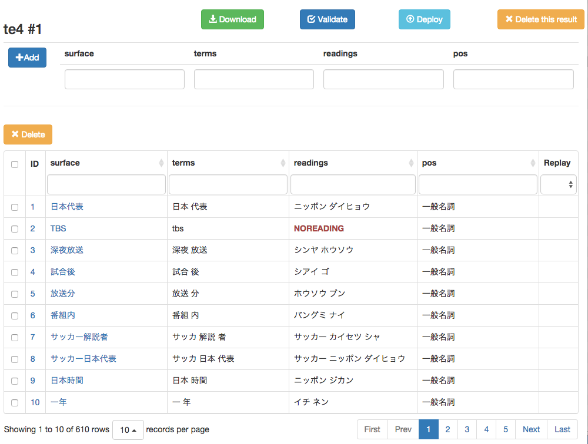

# Framework - a GUI Framework for NLP4L

## Build and Run

Use activator to build the project and run.

```
$ ./activator run
```

## Play with GUI

### Access to the framework GUI

Open [http://localhost:9000/](http://localhost:9000/) with a web browser. You'll see the welcome message in your browser.


### Create a new job

1. Click [New Job](http://localhost:9000/dashboard/job/new) button.



2. Upload a config file. We use examples/simple.conf that comes with this project.

```
{
  settings : {
    global_param1 : val1
    param2 : 333
  }
  dictionary : [
    {
      class : org.nlp4l.sample.SimpleDictionaryAttributeFactory
      settings : {
        param1 : val1
        param2 : val2
        doSome : true
      }
    }
  ]

  processors : [
    {
      class : org.nlp4l.sample.SimpleProcessorFactory
      settings : {
        param1 : val1
      }
    }
    {
      class : org.nlp4l.framework.builtin.SortProcessorFactory
      settings : {
        cellname : cell02
        order: desc
      }
    }
    {
      class : org.nlp4l.framework.processors.WrapProcessor
      recordProcessors : [
        {
          class : org.nlp4l.sample.SimpleRecordProcessorFactory
          settings : {
            param1 : val2
          }
        }
      ]
    }
    {
      class : org.nlp4l.framework.builtin.ReplayProcessorFactory
      settings : {
      }
    }
    {
      class : org.nlp4l.framework.builtin.SortProcessorFactory
      settings : {
        cellname : cell02
        order: desc
      }
    }
    {
      class : org.nlp4l.framework.builtin.MergeProcessorFactory
      settings : {
        cellname : cell02
        glue: ;
      }
    }
  ]
  validators : [
    {
      class : org.nlp4l.sample.SimpleValidatorFactory
      settings : {
        param1 : val1
      }
    }
    {
      class : org.nlp4l.sample.Simple2ValidatorFactory
      settings : {
      }
    }
  ]
  writer : {
    class : org.nlp4l.sample.SimpleWriterFactory
    settings : {
      filename : "/tmp/nlp4l_dic.txt"
    }
  }
}
```

3. Enter a name for this job in Job Name text box and click save button to save the job configuration.

### Run the job

Once a job successfully uploaded, Run button appears. Click the Run button. If you upload examples/simple.conf, it takes a couple of seconds to finish. The job status can be seen in [Job Status](http://localhost:9000/dashboard/job/status) screen.



To see the latest job status, you need to click Job Status. If it finished, you'll observe that the job has been done.


### See the result

Click Job ID in Job Status screen to see the result of the job. In the job screen, click the latest Run ID (#1 in this case) to see the result of the job.


To verify the result, click Validate button. To deploy this result to Solr or Elasticsearch, click Deploy button.

## Sample config files

### Loan Words Extraction

```
{
  dictionary : [
    {
      class : org.nlp4l.syn.UnifySynonymRecordsDictionaryAttributeFactory
      settings : {
      }
    }
  ]

  processors : [
    {
      class : org.nlp4l.syn.LoanWordsProcessorFactory
      settings : {
        index : /opt/nlp4l/jawiki/index
        field : ka_pair
        modelIndex : /opt/nlp4l/transliteration/index
        threshold : 0.8
        minDocFreq : 3
      }
    }
    {
      class : org.nlp4l.syn.UnifySynonymRecordsProcessorFactory
      settings : {
        sortReverse: false
        separator: ","
      }
    }
    {
      class : org.nlp4l.framework.builtin.SortProcessorFactory
      settings : {
        cellname : synonyms
        order: asc
      }
    }
  ]
}
```

The result of the loanwords dictionary looks like:



### Terms Extraction

```
{
  dictionary : [
    {
      class : org.nlp4l.framework.builtin.JaUserDictionaryDictionaryAttributeFactory
      settings : {
        searchOnSolr: "http://localhost:8983/solr"
        collection: "collection1"
        idField: "url"
        hlField: "body2"
      }
    }
  ]

  processors : [
    {
      class : org.nlp4l.extract.TermsExtractionProcessorFactory
      settings : {
        index : /opt/nlp4l/ldcc/index-ldcc-sports-watch
        field : body
        outScore : true
      }
    }
    {
      class : org.nlp4l.framework.builtin.StopWordsProcessorFactory
      settings : {
        file : /opt/nlp4l/ipadic/system-dic.csv
        encoding : EUC_JP
        separator : ","
        column : 1
        cellName : term
      }
    }
    {
      class : org.nlp4l.framework.builtin.JaUserDictionaryProcessorFactory
      settings : {
        cellName : term
        pos : "一般名詞"
      }
    }
    {
      class : org.nlp4l.framework.builtin.ReplayProcessorFactory
      settings : {
      }
    }
  ]

  validators : [
    {
      class : org.nlp4l.framework.builtin.UniqueRecordValidatorFactory
      settings : {
        cellName : surface
      }
    }
    {
      class : org.nlp4l.framework.builtin.RegexValidatorFactory
      settings : {
        cellName : readings
        regexDeny : NOREADING
      }
    }
  ]

  writer : {
    class : org.nlp4l.framework.builtin.CSVFileWriterFactory
    settings : {
      separator: ","
      url: "http://localhost:8983/solr/nlp4l/receive/file"
      file: "./solr/collection1/conf/userdict.txt"
      encoding: UTF-8
    }
  }
}
```

The result of the terms extraction looks like:



### Buddy Words Extraction

```
{
  dictionary : [
    {
      class : org.nlp4l.colloc.BuddyWordsDictionaryAttributeFactory
      settings : {
      }
    }
  ]

  processors : [
    {
      class : org.nlp4l.colloc.BuddyWordsProcessorFactory
      settings : {
        index : /opt/nlp4l/ldcc/index
        field : body
        maxDocsToAnalyze : 1000
        slop : 5
        maxCoiTermsPerTerm : 20
        maxBaseTermsPerDoc : 10000
      }
    }
  ]
}
```

## Work with nlp4l components

To use processors that are implemented in NLP4L/nlp4l project such as LoanWordsProcessor, TermsExtractionProcessor and BuddyWordsProcessor, nlp4l jar (fat jar at the moment) needs to be placed under lib directory. To build (fat) jar of nlp4l, executing the following sbt command.

```shell
$ sbt assembly
```

You'll see the file nlp4l-assembly-VERSION.jar under target/scala-2.11 directory. Copy the jar file to framework/lib directory.
